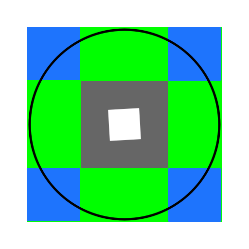

# Open309

An open-source 3D Printed Crown 309 fightstick body replacement.

This started out as a way to create a NEW Helpme body that supported Omron D2RV-LG silent switches. But it may also be used by anybody to tweak and print their own 309 body and adjust the collar shape and switch spacing, or just print a replacement if your old body breaks.

The body is in 3 parts to minimize what needs to be printed while tweaking things, as well as make it print with minimal supports:

* *Collar*. This works as a replacement for the stock NEW Helpme collar, you can mix and match with the original collar and body.
* *Body* the middle part (that holds the grommet).
* *Switch Plate*. This holds the switch spacing.

# Printing

There are premade .STLs over in the [Releases](https://github.com/not-magic/Open309/releases)

## Parts Required

All parts were designed to fit the [Crown CWL-309-MJ-NEW-Helpme-KMS-ST30 Joystick](https://focusattack.com/crown-cwl-309-mj-new-helpme-kms-st30-joystick/)

Other 309 variants may also work, but don't have any of them so I am not sure. It is likely they can all work with minimal modifications.

To assemble this you will also need `8x 16mm M2 bolts with nuts`, to attach the switches to the switch plate. The height of the switch plate is designed for exactly 16mm bolts so anything else will either not reach the nuts or will intersect with the body.

## Print settings

Tolerances were optimized for printing on my Prusa Mk3s with a 0.6 mm nozzle, using Overture PLA+.

If the collar is printed I would recommend using a random seam position, and lightly sanding the collar. This will prevent a noticeable bump in collar shape. I print the collar upside down with supports, which creates some pretty bad surface quality that is entirely hidden by the mounting plate.

There are two collar variations, one with ridges, to minimize supports, and a flat version. The jury is out if the ridges help much, it produces fewer but harder to remove supports.

# Modifying the design

This was made using [OpenSCAD](https://openscad.org/), which is a free open source parametric modeller. Once you open the file you can modify variables in the customizer (Window | Customizer in the menu) or just modify the source directly.

In this example image:

* The green area represents when one switch is triggered for a cardinal direction.
* The blue area represents when two switches are triggered for a diagonal.
* The grey box is the switch deadzone, which is required for proper function of the switches. Switches may activate at 1.4mm but may not deactivate until the lever is moved back 0.3mm. The lever must sit neutrally outside of this zone or switches cannot deactivate.
* The white area is the neutral deadzone, where the switches have no interaction. On a levered switch this will be slightly twisted because the switch levers rotate.
* The black circle represents a circular collar, the cap on the max rotation of the stick.

The proper switch spacing is a balance:
* Diagonals need to be large enough to be hit reliably.
* Cardinal zones need to be shallow enough you can reliably double tap the directions for dashing.
* Cardinal zones need to be wide enough to reliably find them.

You can make dash actions more reliable by increasing the grommet tension as it will return into the safe neutral zone faster.

* _SWITCH_SPACING_AWAY_ - This is the distance of switches to the center. The larger the value, the larger the safe neutral zone becomes and the smaller the activation zones become.
* _SWITCH_SPACING_SIDEWAYS_ - This moves the switches perpedicular to the center. A smaller value (it is negative) will increase the size of the switch deadzone, reduce the tactility of the switches, increase the resistance to tolerance errors, and reduce how much the safe neutral is twisted.
* _SWITCH_ROTATION_ - This will rotate the switches towards (negative) or away from the center (positive). This may be necessary if the switches do not trigger when the lever is exactly parallel. Adjusting this will also twist all of the activation zones.
* _STICK_THROW_DEGREES_ - This is the max rotation of the lever (e.g. max throw angle) which is used to generate the collar angles. This adjusts the size of the collar.
* _SWITCH_GUARD_DISTANCE_ - This will adjust the size of the gate in the switch plate. This may never be hit, but due to the way korean levers work, applying enough pressure you can force the grommet to deform and push the actuator towards the lever anyway. This is protection against damaging the switches. If you find you are hitting this with space to go, lower this distance.
* _SHAFT_DIAMETER_ - This is the diameter of the shaft, used to generate the collar range of motion.
* _SQUIRCLENESS_  - This affects the shape of the collar. At 0 it is a perfect circle. Higher numbers warp it into a square.

Using a larger sized actuator has the same basic effect of reducing the switch away spacing, except it may also reduce the throw angle if it hits the switch guard.

### Exporting it

Using the 'PART' parameter, select each part and export it with F6, then F7

Alternatively on linux you can run `make` to rebuild every part. Use `make -j 32` (or your core count number) to process them in parallel.

